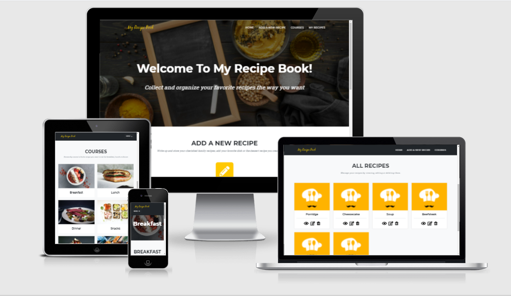

## Contents
- [My Recipe Book site](#my-recipe-book-site)
- [UX](#ux)
- [Database Schema](#database-schema)
- [Technologies Used](#technologies-used)
- [Testing](#testing)
- [Deployment](#deployment)
- [Credits](#credits)

# My Recipe Book site 
My Recipe Book was built to demostrate my ability to design, develop and implement a back-end for a full-stack web application as well as to be able to manipulate data in non-relational database. The programming languages that were used are HTML, CSS, JavaScript and Python.



# UX

## Who is this website for?
For users who want to record and store their recipes in an online cookbook.

## What it is that they want to achieve?
They need a simple way to write down new cooking recipes in an online recipe book, be able to find them, edit or delete.

## How does the project fulfil the users’ needs?
It provides an intuitive user interface for creation of new recipes. A recipe category can be assigned to a recipe that helps to search for it later, as each category lists all related recipes on a separate page. All recipes overview is also available to website users. They are able to view already existing recepies, modify and remove them.  

## Wireframes
The [wireframes](https://github.com/AnaStasia1331/ms3-my-recipe-book/tree/master/static/img/readme/my-recipe-book-wireframes.pdf) were created using Balsamiq tool.

## User Stories 
As a website user, I want to:

1. be able to create a new recipe.
2. be able to find an existing recipe based on the category/group it belongs to.
3. be able to access all recipes in a single place.
4. view the details of an existing recipe.
5. edit a recipe.
6. delete a recipe.
7. access the website from multiple devices of different sizes without major UI issues.

## Nice-to-have features 

1. Login functionality.
2. Image upload for a specific recipe.

# Database Schema 

MongoDB was used for storing data for the project.

The database schema:


# Technologies Used

The below list includes all of the languages, frameworks, tools, learning platforms and stock image websites I have used to create this project. 
- [HTML](https://en.wikipedia.org/wiki/HTML5)
- [CSS](https://en.wikipedia.org/wiki/CSS)
- [JavaScript](https://en.wikipedia.org/wiki/JavaScript)
- [Bootstrap](https://getbootstrap.com/docs/5.0/getting-started/introduction/) 
    - imported a free bootstrap theme ['Agency'](https://startbootstrap.com/theme/agency)
- [Python](https://www.python.org/downloads/release/python-3811/)
    - [Flask](https://flask.palletsprojects.com/en/2.0.x/)
    - [Jinja](https://jinja.palletsprojects.com/en/3.0.x/)
- [Heroku](https://dashboard.heroku.com/apps)
- [MongoDb](https://www.mongodb.com/)
- [Git](https://git-scm.com/)
- [GitHub](https://github.com/)
- [Gitpod](https://www.gitpod.io/)
- [Unsplash](https://unsplash.com/)
- [DesignEvo Free Logo Maker](https://www.designevo.com/)
- [Flaticon](https://www.flaticon.com) 
- [Pinetools](https://pinetools.com/darken-image)
- [Google fonts](https://fonts.google.com/specimen/Quicksand)
- [Fontawesome](https://fontawesome.com/)
- [Balsamiq](https://balsamiq.com/wireframes/)
- [ColorPick Eyedropper](https://chrome.google.com/webstore/detail/colorpick-eyedropper/ohcpnigalekghcmgcdcenkpelffpdolg)
- [Chrome dev tools](https://developers.google.com/web/tools/chrome-devtools)
- [Code Institute learning platform](https://codeinstitute.net/)
- [W3schools](https://www.w3schools.com/)
- [Stack Overflow](https://stackoverflow.com/)
- [JavaScript validator](https://jshint.com/)
- [Jigsaw](https://jigsaw.w3.org/css-validator/validator)
- [W3C validator](https://validator.w3.org/)
- [Python formatter](http://pep8online.com/)

# Testing

## Test environments
Google Chrome dev tool was used during development to make sure the website is responsiveness. The final testing of the deployed site was performed on the devices:
- Laptop HP ZBook 15 G3, 1920x1080-pixel screen resolution, Google Chrome browser.
- Iphone XR with 1792 x 828-pixel screen resolution, Safari browser.

## Testing User Stories from User Experience (UX) Section

1. Home page.  
    * Expected: user clicks the nav and social media links from the Home page and is redirected to the right pages/sections.
    * Testing:
        * click on the Home nav item -> the Home page is refreshed;
        * click on the logo -> the Home page is refreshed;
        * click on the Add A New Recipe nav item -> Add A New Recipe form is opened with 2 buttons: Cancel and Save;
        * click on the Courses nav item -> the Courses section is opened with multiple courses types;
        * click on the My Recipes nav item -> All Recipes page is opened either with recipe cards or 'No recipes have been added yet' text;
        * click on the Add A New Recipe pencil icon -> Add A New Recipe form is opened with 2 buttons: Cancel and Save;
        * click on each Course picture in the Course section -> page is loaded for the specific Course type, e.g. breakfast or dinner. The page displays recipes in the selected category or 'No recipes have been added yet' text;
        * click on the facebook/instagram/twitter icons -> facebook/instagram/twitter page is opened in a separate tab.
2. Add a New Recipe form (covers the user story #1).
    * Expected: when user forgets to add a title to a recipe, the new recipe can't be created.
    * Testing:
        * leave the Recipe Name field empty and try to save the recipe -> user is asked to fill in the field and the recipe wasn't saved.
    * Expected: when user forgets to select a course from the dropdown, the new recipe can't be created.
    * Testing:
        * fill in the Recipe Name, but leave the default text selected in the Couse dropdown and try to save the recipe -> user is asked to select a course and the recipe wasn't saved.
    * Expected: user can save a recipe with a recipe name with no more than 50 characters.
    * Testing:
        * try to add recipe name containing more than 50 char  -> after 50th character typing is not possible.
    * Expected: user can select any course type from the Courses dropdown.
    * Testing:
        * click the dropdown -> all 6 course types are visible in the dropdown;
        * select a value from the dropdown -> the correct value is selected.
    * Expected: user can paste/type large amount of text in Ingredients and Steps textarea.
    * Testing:
        * paste a long text (more than 2000 characters) -> the long text is accepted.
    * Expected: user can set preparation time.
    * Testing:
        * select a half an hour or an hour as cooking time -> the correct time is set.
    * Expected: user can cancel the recipe creation.
    * Testing:
        * click the Cancel button -> from Add a New Recipe form the user is redirected back the page visited earlier.
    * Expected: user can save a new recipe successfully.
    * Testing:
        * fill in all required and optional fields in the form and click the Save button -> user is redirected to the All Recipes page, he can find his recipe on the page based on title. When he opens the recipe, he can see that it contains all text/selection filled in earlier.
3. All Recipes page (covers the user story #3).
    * Expected: the links on the page work. 
    * Testing:
        * test all nav item and footer links -> each link redirects to the desired page/section.
        * preconditon: at least 1 recipe must be created:
            * on the recipe card click the View icon -> View Recipe page is opened;
            * on the recipe card click the Edit icon -> Edit Recipe page is opened;
            * on the recipe card click the Delete icon -> the delete modal window for the selected recipe pops up.
    * Expected: when many recipes were created on the page, the cards layout displays without major issues.
    * Testing:
        * create more than 4 recipes (for desktop) -> the recipes are displayed in 4 columns. They have the same size: height and width regardless difference in title length. Long titles are shown with ellipsis;
        * create many recipes to check the list is scrollable -> user can scroll without issues.
    * Expected: all created recipes can be found on the All Recipes page.
    * Testing:
        * create several recipes with different course types -> regardless the course assigned to the recipes, they all display on the All Recipes page.
4. Edit Recipe form (covers the user story #5).
    * Expected: user is able to update any field of the edit form.
    * Testing:
        * find an existing recipe, press the Edit icon and try to edit Recipe Name, Courses, Ingredients, Steps, Preparation Time -> all mentioned places are editable.
    * Expected: user is able to update the edit form successfully.
    * Testing:
        * edit Recipe Name, Courses, Ingredients, Steps, Preparation Time and click the Save button -> user is redirected to All Recipes page, can find his recipe and when press the View or Edit icons can see that the previously made changes were applied.
    * Expected: user is able to cancel form editing.
    * Testing:
        * edit an existing recipe and click the Cancel button -> user is redirected to the previously visited page, when he reopens the recipe he can't see the change he made before pressing the Cancel button.
5. View Recipe form (covers the user story #4).
    * Expected: user is able to view an existing recipe but can't update the recipe in the view mode.
    * Testing:
        * find an existing recipe, press the View icon try to edit Recipe Name, Courses, Ingredients, Steps, Preparation Time -> all mentioned places are for read only and can't be updated.
    * Expected: user is able to view an existing recipe and proceed to the edit mode.
    * Testing:
        * open a recipe in the view mode and press the Edit button -> user is redirected to the Edit Recipe page for the same recipe.  
    * Expected: user is able to view an existing recipe and close the view mode.
    * Testing:
        * open a recipe in the view mode and press the Back button -> user is redirected back to the previously visited page.
6. Delete recipe (covers the user story #6).
    * Expected: user can select a recipe on All Recipes page or a specific course page and click the Delete icon.
    * Testing:
        * find an existing recipe, press the Delete icon -> the Confirm delete popup opens for the selected recipe.
    * Expected: user can delete an existing recipe
    * Testing:
        * find an existing recipe, press the Delete icon, confirm the action -> the popup is closed, the recipe has been deleted. It cannot be found on the related course page or All Recipes page.
    * Expected: user can cancel the delete action from the Confirm delete popup.
    * Testing:
        * find an existing recipe, press the Delete icon, cancel the action -> the popup is closed, the recipe has not been removed neither from the related course page nor from the All Recipes page.
7. Course page (covers the user story #2)
    * Expected: user should be able to find his recipes quicker, based on course type.
        * Testing:
            * precondition: add recipe in e.g. breakfast category. From the Home page click 'Breakfast' in the Course section -> the created recipes is displayed on the Breakfast page.
8. No recipes created.
    * Expected: user should be informed when no recipes were created yet on a particular course page or All Recipes page.
    * Testing:
        * find a course type when no recipes were added -> user sees the message 'No recipes have been added yet.'
9. Page not found.
    * Expected: user should be informed when no recipes were created yet on a particular course page or All Recipes page.
    * Testing:
        * hit a non-exisitng url, e.g. https://ms3-my-recipe-book.herokuapp.com/course_non-existing/other_courses -> user sees the 404 page.
10. Testing on mobile device (covers the user story #7).
    * Expected: every page of the website should display without issues; user should be able to easily navigate through My Recipe Book; creation/viewing/editing/deletion must be possible to do from the mobile device.
    * Testing:
        * open the Home page -> the page is opened, the navigation links are hidden but instead there is the Menu button. When clicked, all links are present in the expanded menu.
        * scroll down the Home page -> Add a new recipe section and Courses section are visible. Courses cards/links are displayed in 1 column.
        * open the All recipes page with multiple recipes created -> all recipes are displayed in 1 column.
        * create/view/edit/delete a recipe -> each action can be performed successfully.

## Major bugs discovered and fixed:
1. When triggering the delete recipe popup, for example, for the 3d recipe on the page, it showed the first recipe to remove. Fixed by passing {{ recipe._id }} into the delete popup.

## Known bugs:
1. On very big screen, the footer can display large width.

## Further Testing (to edit):

- [W3C Markup Validator](https://validator.w3.org/) was used to validate every HTML page of the project on syntax error. No issues have been detected.

- [Jigsaw](https://jigsaw.w3.org/css-validator/) service was used to validate css files. No validation errors have been detected.

- Run the JS files through [Jshint](https://jshint.com/) linter, there are warnings but no major issues.
- [Python validator](http://pep8online.com/) warned about lines being too long.
- Dev tool in Google Chrome was used to check on console errors. 2 errors was fixed by removing the unused js code.
- testing of the README links was performed.

# Deployment

## Run the project locally (to edit)

Steps:

1. Open the repository in GitHub https://github.com/AnaStasia1331/ms3-my-recipe-book.
2. Find the Code button, choose the HTTPS clone option, copy the command.
3. Open a local directory where you want to clone the project to.
4. Open the Git Bash terminal in that directory.
5. Type the command 'git clone' plus the copied https url. 
6. After executing the command, the repository will be created in the local directory.
7. ....

## Heroku 
I've published my website using Heroku. To deploy a project, one should follow these steps:

1. As a prerequisite, your project must contain _requirements.txt_. Heroku uses that file to know what application and dependencies are required to run the app. To create _requirements.txt_ in the project run the command: 
```
pip3 freeze --local > requirements.txt
```
2. Next, create the _Procfile_ that specifies the commands that are executed by the app on startup. Execute the command: 
```
echo web: python app.py > Procfile
```
3. On Heroku website https://dashboard.heroku.com/apps create a new app. The app must have a unique name.
4. In the _Deploy_ tab -> _App connected to GitHub_ section connect the Heroku app to your GitHub account.
5. In the _Settings_ tab -> _Config Vars_ click the _Reveal Config Vars_ button. Copy and save the key-value pairs that mentioned in the _env.py_ of your project.
6. In the _Deploy_ tab -> _Automatic deploys_ enable automatic deploys. 
7. To open the website from Heroku, click on the _Open app_ button.

My project is accessible via this link https://ms3-my-recipe-book.herokuapp.com/

# Credits

## Code
Major credits go to:
 - [Bootstrap free theme 'Agency'](https://startbootstrap.com/theme/agency) was imported into the project with written HTML, CSS and JS files. The theme was significantly modified for the needs of the project.
 - code examples of how to work with Flask framework provided during the 'Backend Development' course from Code Institute.

## Media
- To make the website look colorful and attractive, several images were used from [Unsplash](https://unsplash.com/). Dark filter was applied on the top of some images with the help of [Pinetools](https://pinetools.com/darken-image)
- Recipe card image (chef cap) was designed in the tool [DesignEvo Free Logo Maker](https://www.designevo.com/)
- [Flaticon](https://www.flaticon.com) allowed to create the logo.

## Acknowledgements 
- Code Institute for the provided study materials and the idea for MS3 project.